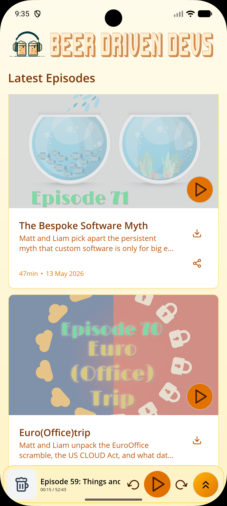
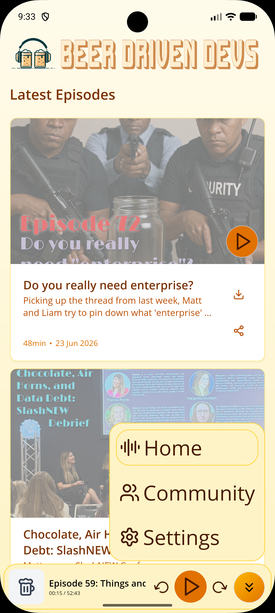
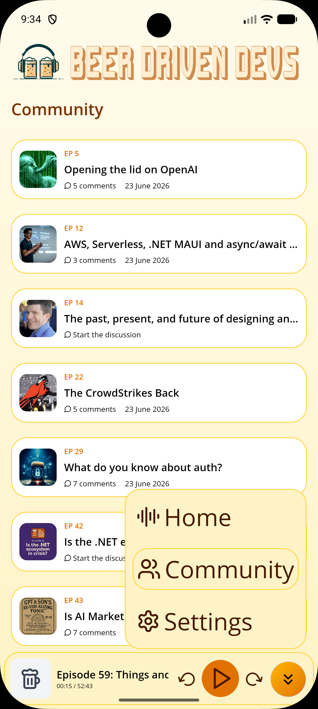

# 🍻 Beer Driven Devs App

Welcome to the (very unofficial) mobile app for the [Beer Driven Devs](https://www.beerdriven.dev) podcast!

This app is built using **.NET MAUI** and is a fun, ongoing experiment in exploring modern mobile UX, download handling, and (of course) ridiculous microinteractions.

<table>
    <tr>
        <td></td>
        <td></td>
        <td></td>
    </tr>
</table>

## 🎙️ What is Beer Driven Devs?

Two mates in the Australian software industry talking code, design, side projects, and life, always over a beer (or a whisky, or sometimes a soda).  
Check out the podcast [here](https://www.beerdriven.dev).

## 🍺 About this app

- Browse and listen to podcast episodes
- Download episodes for offline listening
- Explore progressive download UX microinteractions (from basic modals to beer glass fills and foam effects!)

## 🚧 Work in Progress

This repo is a **WIP experiment**, and many features (like community and auth) are still under active development.  
Feel free to fork, explore, and laugh at our over-the-top microinteraction experiments.

## 💡 Key Tech

- [.NET MAUI](https://learn.microsoft.com/dotnet/maui/)
- [Flagstone UI](https://github.com/matt-goldman/flagstone-ui)
- [MAUI Community Toolkit](https://learn.microsoft.com/dotnet/communitytoolkit/maui/)
- [MVVM Toolkit](https://learn.microsoft.com/dotnet/communitytoolkit/mvvm/)
- [SkiaSharp](https://github.com/mono/SkiaSharp)
- [SkiaSharp.Extended.UI](https://github.com/mono/SkiaSharp.Extended)

## 📚 Branch structure

The repo is structured into "levels" to showcase different stages of download UX:

- `level-0`: Modal overlay
- `level-1`: Simple thumbnail progress label
- `level-2`: Activity indicator + cancel
- `level-3`: Progress bar overlay
- `main` (level-4): Beer fill & foam finale

This was setup specifically to support a [blog post](https://goforgoldman.com/posts/bdd-app-downloads/) as part of [MAUI UI July 2025](https://goforgoldman.com/posts/mauiuijuly-25/).
